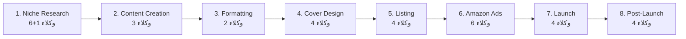

<p align="center">
  
  
  
  <br>
  <strong>🛰️ منصة متكاملة لاكتشاف وتحليل الفرص الربحية في سوق Kindle Direct Publishing (KDP)</strong>
  <br>
  تجميع بيانات ← تحليل ذكي ← تصدير ← لوحة تحكم تفاعلية ← محرك اكتشاف متقدم
</p>

<p align="center">
  <a href="#-عن-الأداة">عن الأداة</a> ·
  <a href="#-الميزات-الرئيسية">الميزات</a> ·
  <a href="#-طريقة-التثبيت">التثبيت</a> ·
  <a href="#-طريقة-الاستخدام">الاستخدام</a> ·
  <a href="#-الميزات-المتقدمة">المتقدمة</a> ·
  <a href="#-نظام-multi-agent-pipeline">Multi-Agent</a> ·
  <a href="#-المصادر-والمراجع">المصادر</a>
</p>

---

## 🌟 عن الأداة

**KDP Research Pipeline** منصة مفتوحة المصدر لمؤلفي KDP، تغطي دورة حياة الكتاب بالكامل:

| المرحلة | الوظيفة | الحالة |
|---------|---------|--------|
| 1. **Niche Research** | اكتشاف المجالات الربحية وتحليل المنافسين | ✅ مكتمل |
| 2. **Content Creation** | تخطيط وكتابة المخطوطات عبر 33 وكيل ذكي | ✅ مكتمل |
| 3. **Formatting & Layout** | تنسيق إلكتروني + طباعي | ⏳ قادم |
| 4. **Cover Design** | تصميم الغلاف | ⏳ قادم |
| 5. **Listing Optimization** | عنوان + وصف + كلمات مفتاحية | ⏳ قادم |
| 6. **Amazon Ads** | إعلانات أمازون المُدارة | ⏳ قادم |
| 7. **Launch Strategy** | خطة إطلاق متكاملة | ⏳ قادم |
| 8. **Post-Launch Monitoring** | مراقبة + تحديثات | ⏳ قادم |

> 📘 **دراسة حالة:** **Low-FODMAP Kids' Cookbook** — 26 فصلاً، 68 وصفة، 33,879 كلمة، ~236 صفحة

---

## ✨ الميزات الرئيسية

| الميزة | الوصف |
|--------|-------|
| 🔍 **3 طرق بحث** | كلمة مفتاحية ← URL كامل (Tunneling) ← تفاصيل منتج |
| 🧠 **SmartScore** | مقياس فرصة ذكي يجمع بين المبيعات والمنافسة |
| 💎 **Gold Mine** | كشف المنتجات ذات الطلب العالي والمنافسة المنخفضة |
| 📊 **Streamlit Dashboard** | 3 تبويبات + تصميم داكن + Developer Mode |
| 🗄️ **SQLite محلي** | حفظ سجل البحث + الإعدادات + قائمة الاكتشاف |
| 🚀 **New Release Mode** | تصفية فقط الإصدارات الجديدة (آخر 30 يوم) |
| 🕳️ **Multi-Niche Tunneling** | إدخال رابط أمازون واستخراج البيانات مباشرة |
| 🔗 **Smart Discovery** | اكتشاف كلمات مفتاحية ومجالات جديدة من ASIN |
| 🤖 **33 وكيل ذكي** | تخطيط وكتابة الكتاب كاملاً عبر 8 مراحل |
| 🏗️ **PyInstaller Build** | تطبيق `.exe` مستقل للتوزيع |

---

## 🏗️ البنية المعمارية

```
┌───────────────────────────────────────────────────────────────┐
│                    main.py  /  app.py                          │
│            (سطر الأوامر)  (Streamlit Dashboard)                │
├───────────────────────────────────────────────────────────────┤
│  ┌──────────┐  ┌──────────┐  ┌──────────┐  ┌───────────────┐ │
│  │ scraper  │→│ analyzer │→│ exporter │  │ config_manager│ │
│  │ .py      │  │ .py      │  │ .py      │  │ .py           │ │
│  └──────────┘  └──────────┘  └──────────┘  └───────────────┘ │
│  ┌───────────────┐  ┌──────────────────────────────────────┐ │
│  │ database.py   │  │ manuscript-*.md (8 files, 68 recipes) │ │
│  │ (SQLite)      │  │ + system-prompt-kdp.md               │ │
│  └───────────────┘  └──────────────────────────────────────┘ │
├───────────────────────────────────────────────────────────────┤
│              SerpApi API  ←→  Amazon Search / Product         │
└───────────────────────────────────────────────────────────────┘
```

### مسار البيانات

```
بحث (SerpApi) → تصفية → تحليل → SmartScore → تصدير (Sheets / JSON) → Dashboard
```

---

## 📦 طريقة التثبيت

### 1. المتطلبات الأساسية

| المتطلب | الحد الأدنى | الموصى به |
|---------|------------|-----------|
| **Python** | 3.9 | 3.11+ |
| **نظام التشغيل** | Windows 10 / macOS 12+ / Linux | أي 64-bit |
| **مفتاح SerpApi** | مجاني (100 بحث/شهر) | مدفوع (حسب الحاجة) |
| **اتصال بالإنترنت** | مطلوب لاستدعاء API | عالي السرعة |

### 2. تنزيل المشروع

```bash
git clone https://github.com/saiedpod-bot/-KDP-Research-Pipeline.git
cd KDP-Research-Pipeline
```

### 3. إعداد البيئة الافتراضية

<details open>
<summary><b>Windows</b></summary>

```cmd
python -m venv .venv
.venv\Scripts\activate
pip install --upgrade pip
pip install -r requirements.txt
```
</details>

<details>
<summary><b>macOS / Linux</b></summary>

```bash
python3 -m venv .venv
source .venv/bin/activate
pip install --upgrade pip
pip install -r requirements.txt
```
</details>

### 4. إعداد مفتاح SerpApi

```bash
cp .env.example .env
```

ثم افتح `.env` واكتب مفتاحك:

```ini
SERPAPI_KEY=your_serpapi_key_here
```

> 🔑 احصل على مفتاح مجاني من [serpapi.com](https://serpapi.com) (يكفي لـ 100 بحث في الشهر)

---

## 💻 طريقة الاستخدام

### ▶️ سطر الأوامر (CLI)

```bash
# بحث سريع (صفحة واحدة)
python main.py "low fodmap cookbook for kids"

# بحث عميق (5 صفحات)
python main.py "coloring books for adults" --max-pages 5 --min-price 7.00

# تصدير إلى Google Sheets
python main.py "adhd planner" --max-pages 5 --sheet-id "1abc123..."
```

| الباراميتر | النوع | الافتراضي | الشرح |
|-----------|------|----------|-------|
| `query` | نص | **إجباري** | كلمة البحث |
| `--max-pages` | رقم | 3 | عدد الصفحات (كل صفحة ← 20-50 منتج) |
| `--min-price` | رقم | 5.00 | أقل سعر للتصفية |
| `--sheet-id` | نص | — | معرف Google Sheet للتصدير |

| عمق البحث | الأمر | النتائج | الاستخدام |
|-----------|-------|---------|-----------|
| 🟢 سريع | `--max-pages 1` | 20-50 | اختبار أولي |
| 🟡 قياسي | `--max-pages 3` | 50-150 | تحليل منافسة روتيني |
| 🔴 عميق | `--max-pages 5` | 100-200+ | مجالات مزدحمة |

### 🖥️ لوحة التحكم (Streamlit Dashboard)

```bash
streamlit run app.py
```

يفتح في المتصفح على `http://localhost:8501`

#### تبويبات Dashboard

| التبويب | الوظيفة |
|---------|---------|
| **📊 Dashboard** | بحث + تصفية + New Release + Tunneling + Discover More |
| **⚙️ Settings** | إدخال SerpApi key + Sheet ID + Clear History |
| **📜 History** | سجل آخر 50 بحث + تحميل النتائج + Discovery Queue |

#### الشريط الجانبي

| العنصر | الوظيفة |
|--------|---------|
| **👨‍💻 Developer Mode** | إظهار/إخفاء السجلات التقنية (يُحفظ في SQLite) |
| **🆕 New Release Mode** | تصفية آخر 30 يوم فقط |

---

## 🧠 SmartScore — مقياس الفرصة الذكية

```
SmartScore = ReviewCount / (BSR + 1)
```

| القيمة | الدلالة |
|--------|---------|
| **ReviewCount عالي** | طلب قوي + دليل اجتماعي |
| **BSR منخفض** | سرعة مبيعات عالية |
| **القسمة على (BSR+1)** | تعاقب المنافسين الراسخين |
| **النتيجة** | كلما زاد الرقم = فرصة أكبر |

> ⚠️ **ملاحظة:** حالياً BSR = 0 لجميع النتائج (يحتاج Product API). SmartScore = ReviewCount مؤقتاً.

---

## 💎 Gold Mine — منجم الفرص

```
+==========================================================+
|  GOLD MINE -- Top 5 Low-Competition Opportunities        |
+==========================================================+
| Rank ASIN               Score   Price  Reviews Rating |
|----- -------------- --------- ------- -------- ------ |
|    1 B0DZY2V81Z        0.0000    8.49        0    4.7 |
+==========================================================+
```

### شروط الجوهرة ✅

| الشرط | القيمة | المعنى |
|-------|--------|--------|
| BSR | < 50,000 | المنتج يبيع |
| ReviewCount | < 30 | المجال غير مشبع |

> 💡 **نصيحة:** ركز على المنتجات ذات 10-29 مراجعة وتقييم عالي ← دليل أن المجال يحقق مبيعات

---

## 🔬 شرح المكونات

### Tier 1 — Scraper (التجميع)

**الملف:** `core/scraper.py` · **الوظيفة:** جلب البيانات من أمازون عبر SerpApi

| الدالة | الوظيفة |
|--------|---------|
| `fetch_amazon_data(query, api_key, page)` | جلب صفحة واحدة |
| `fetch_all_pages(query, api_key, max_pages, filter_params)` | جلب صفحات متعددة + إزالة تكرار |
| `fetch_amazon_data_paginated(query, api_key, max_pages, filter_params)` | جلب مع ترقيم متسلسل |
| `search_and_format(query, api_key, max_pages, filter_params)` | جلب + تنسيق في خطوة |
| `fetch_product_details(asin, api_key)` | تفاصيل منتج محدد (1 رصيد SerpApi) |
| `fetch_category_url(url, api_key)` | جلب من رابط أمازون مباشرة |
| `tunnel_category_pages(url, api_key, max_pages)` | تمرير صفحات من رابط واحد |

> **آلية التكرار (Backoff):** 1s → 2s → 4s → 8s → 16s (حتى 5 محاولات)

### Tier 2 — Analyzer (التحليل)

**الملف:** `core/analyzer.py` · **الوظيفة:** تحليل البيانات وتحديد الفرص

| الدالة | الوظيفة |
|--------|---------|
| `run_analysis(rows)` | تحميل → تصفية → تسجيل → حفظ |
| `find_gems_dataframe(df)` | كشف الجواهر باستخدام pandas |
| `find_low_competition_gems(rows)` | كشف الجواهر بدون pandas |
| `filter_by_price(rows, min_price)` | تصفية حسب السعر |

### Tier 3 — Exporter (التصدير)

**الملف:** `core/exporter.py` · **الوظيفة:** تصدير النتائج إلى Google Sheets

| الدالة | الوظيفة |
|--------|---------|
| `run_export(rows, sheet_id, creds_path)` | توثيق → رفع → كتابة |
| `export_with_service_account(rows, sheet_id, creds_path)` | رفع بحساب خدمة Google |

### Tier 4 — Database & Config

**الملفات:** `core/database.py` + `core/config_manager.py`

**جداول SQLite:**

| الجدول | المحتوى |
|--------|---------|
| `search_history` | آخر 50 بحث + معاملات + نتائج |
| `settings` | SerpApi key + Sheet ID + Developer Mode |
| `discovery_queue` | مصطلحات مكتشفة + مصدر + نتيجة |

**أولوية الإعدادات:** SQLite DB → `.env` → متغير البيئة → القيمة الافتراضية

### Tier 5 — Dashboard (Streamlit)

**الملف:** `app.py`


- تصميم داكن (`.streamlit/config.toml`)
- أعمدة تفاعلية: ASIN كرابط قابل للضغط
- Est. Daily Sales = `10000 / BSR`
- تنسيق الأسعار `$%.2f`
- ألوان حسب القيمة

---

## 🚀 الميزات المتقدمة

### 🔍 Smart Niche Discovery

اكتشاف آلي لكلمات مفتاحية من المنتجات الحالية.

```
1. اختيار 3 ASINs من النتائج
2. fetch_product_details() ← SerpApi Product API (3 أرصدة)
3. extract_discovery_terms() ← يستخرج:
   ├── Categories        (الدرجة: 90) ← تصنيفات أمازون
   ├── Bought Together   (الدرجة: 70) ← منتجات تُشترى معاً
   └── Also Bought       (الدرجة: 40) ← منتجات ذات صلة
4. حفظ في discovery_queue ← عرض في Dashboard
```

### 🆕 New Release Mode

```
✅ تفعيل من sidebar checkbox
📡 يُمرر filter_params = {"rh": "p_n_publication_date:1250226011"}
🎯 يظهر فقط الإصدارات الجديدة (آخر 30 يوم)
```

### 🕳️ Multi-Niche Tunneling

```
✅ إدخال رابط أمازون بدلاً من كلمة بحث
📡 يستخدم SerpApi 'url' parameter
🔄 tunnel_category_pages() يمرر صفحات متعددة
🎯 مفيد لـ: Bestsellers / New Releases / تصنيف محدد
```

### 🔧 Search Filters (rh)

```
✅ حقل نصي يمرر rh مباشرة لـ SerpApi
✅ يدعم أي فلتر متصفح أمازون
✅ مثال: p_n_publication_date:1250226011|p_n_condition-type:6350179011
```

### 👨‍💻 Developer Mode

```
✅ checkbox في الشريط الجانبي
✅ يخفي/يظهر السجلات التقنية + بطاقات الحالة
✅ يُحفظ التفضيل في SQLite تلقائياً
```

---

## 🤖 نظام Multi-Agent Pipeline

**الملفات المرجعية:** `multi-agent-full-pipeline.md` · `multi-agent-niche-research.md`

### 33 وكيل ذكي عبر 8 مراحل



| المرحلة | عدد الوكلاء | الوظيفة |
|---------|:----------:|---------|
| 1. Niche Research | 6+1 | أبحاث سوق متعمقة |
| 2. Content Creation | 3 | تخطيط + كتابة + مراجعة |
| 3. Formatting & Layout | 2 | Kindle + Paperback |
| 4. Cover Design | 4 | أمامي + خلفي + 3D |
| 5. Listing Optimization | 4 | عنوان + وصف + Keywords + A+ |
| 6. Amazon Ads | 6 | حملات إعلانية مُدارة |
| 7. Launch Strategy | 4 | ARC + إطلاق + مراجعات |
| 8. Post-Launch Monitoring | 4 | تحليل + تحديث + تفرع |

### دراسة حالة: Low-FODMAP Kids' Cookbook

| المقياس | القيمة |
|---------|-------|
| **عدد الفصول** | 26 فصلاً |
| **عدد الأجزاء** | 8 أجزاء |
| **عدد الوصفات** | 68 وصفة |
| **إجمالي الكلمات** | 33,879 كلمة |
| **الطول التقديري** | 200-250 صفحة |
| **الجمهور المستهدف** | 10-15% من الأطفال |
| **المنافس الوحيد** | 742 مراجعة · 4.5★ |

---

## 📖 مخطوطة الكتاب

| الملف | المحتوى |
|-------|---------|
| `manuscript-frontmatter-part1.md` | المقدمة + أساسيات Low-FODMAP |
| `manuscript-part2-breakfasts.md` | وجبات الإفطار |
| `manuscript-part3-lunchbox.md` | وجبات المدرسة |
| `manuscript-part4-dinner.md` | وجبات العشاء |
| `manuscript-part5-snacks.md` | الوجبات الخفيفة |
| `manuscript-part6-desserts.md` | الحلويات |
| `manuscript-part7-drinks.md` | المشروبات |
| `manuscript-part8-backmatter.md` | الخاتمة + الملاحق |

---

## 📚 المصادر والمراجع

| المصدر | النوع | التكلفة | الاستخدام |
|--------|------|:-------:|-----------|
| [SerpApi](https://serpapi.com) | Amazon Search | 100/شهر مجاني | بحث أمازون |
| [SerpApi Product API](https://serpapi.com/product-search) | Product Detail | 1 رصيد/ASIN | تفاصيل المنتج |
| [Google Sheets API](https://console.cloud.google.com) | Spreadsheet | مجاني | تصدير البيانات |

### المكتبات المطلوبة

| المكتبة | الإصدار | الاستخدام |
|---------|:-------:|-----------|
| `streamlit` | ≥1.28 | لوحة التحكم |
| `pandas` | ≥1.5 | تحليل البيانات |
| `serpapi` | ≥0.1 | واجهة أمازون |
| `requests` | ≥2.28 | اتصالات HTTP |
| `gspread` | ≥5.0 | Google Sheets |
| `google-auth` | ≥2.0 | توثيق Google |

---

## 🔗 طرق الربط والتكامل

### 1. Google Sheets Export

```bash
python main.py "بحث" --sheet-id "1abc..."
```

**التحضير:**
1. حساب خدمة في [Google Cloud Console](https://console.cloud.google.com)
2. تفعيل Google Sheets API
3. رفع `credentials.json` في جذر المشروع

### 2. PyInstaller (تطبيق مستقل)

```bash
pip install pyinstaller
pyinstaller build.spec
```

| الملف | الوصف |
|-------|-------|
| `dist/KDP_Pipeline.exe` | بدون نافذة أوامر |
| `dist/KDP_Pipeline_DEBUG.exe` | مع نافذة أوامر للتصحيح |

### 3. SerpApi Integration

```
Dashboard Settings ← .env ← متغير البيئة
```

---

## 📁 هيكل المشروع

```
KDP-Research-Pipeline/
│
├── app.py                        # Streamlit Dashboard 🖥️
├── main.py                       # CLI Pipeline ▶️
├── requirements.txt              # الاعتماديات 📦
├── build.spec                    # PyInstaller 🏗️
├── config.json                   # API safety lock 🔒
├── .env                          # SerpApi key (gitignored) 🔑
├── .env.example                  # قالب الإعدادات 📝
├── .gitignore
├── README.md
│
├── core/                         # ⭐ الحزمة الأساسية
│   ├── __init__.py               # تصدير الحزمة
│   ├── scraper.py                # التجميع من أمازون 🕷️
│   ├── analyzer.py               # التحليل والتسجيل 🧠
│   ├── exporter.py               # التصدير لـ Google Sheets 📤
│   ├── database.py               # SQLite 🗄️
│   └── config_manager.py         # إدارة الإعدادات ⚙️
│
├── src/                          # الإصدار القديم (احتياطي)
│   ├── scraper.py
│   ├── analyzer.py
│   └── exporter.py
│
├── manuscript-*.md               # 8 ملفات مخطوطة (68 وصفة) 📖
├── system-prompt-kdp.md          # دليل الخبير KDP 📋
├── multi-agent-full-pipeline.md  # 33 وكيل ذكي 🤖
├── multi-agent-niche-research.md # 6 وكلاء أبحاث 🔬
├── memory-repository.md          # مستودع الذاكرة 🧠
├── project_state.json            # حالة المشروع 📊
│
├── database/                     # SQLite (gitignored)
├── output/                       # نتائج (gitignored)
└── .streamlit/
    └── config.toml               # ثيم داكن 🌙
```

---

## 🔄 خارطة الطريق

- [x] **Phase 1:** Niche Research — Market Scanner + Gem Detector
- [x] **Phase 2:** Content Creation — 33,879-word manuscript
- [x] **Phase 3:** Streamlit Dashboard + SQLite + Discovery Engine
- [ ] **Phase 4:** Formatting & Layout (Kindle + Paperback)
- [ ] **Phase 5:** Cover Design (AI-generated)
- [ ] **Phase 6:** Listing Optimization (Title, Description, A+)
- [ ] **Phase 7:** Amazon Ads Campaigns
- [ ] **Phase 8:** Launch Strategy + Post-Launch Monitoring

---

## 📜 الترخيص

**MIT License** — استخدم، عدل، وزع بحرية.

---

<p align="center">
  تم التطوير بواسطة <a href="https://github.com/saiedpod-bot">saiedpod-bot</a> 🛠️<br>
  <sub>آخر تحديث: يونيو 2026</sub>
</p>
