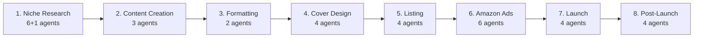

<p align="center">
  
  
  
  
  <br>
  <strong>🛰️ Full-stack niche validation platform for Kindle Direct Publishing</strong>
  <br>
  Data scraping → Smart analysis → Export → Interactive dashboard → Advanced discovery engine
</p>

<p align="center">
  <a href="#-about">About</a> ·
  <a href="#-features">Features</a> ·
  <a href="#-installation">Installation</a> ·
  <a href="#-usage">Usage</a> ·
  <a href="#-advanced-features">Advanced</a> ·
  <a href="#-multi-agent-pipeline">Multi-Agent</a> ·
  <a href="#-roadmap">Roadmap</a>
</p>

---

## 🌟 About

**KDP Research Pipeline** is an open-source platform for KDP authors, covering the complete book lifecycle:

| Phase | Purpose | Status |
|-------|---------|--------|
| 1. **Niche Research** | Market opportunity discovery + competitor analysis | ✅ Complete |
| 2. **Content Creation** | Manuscript planning & writing via 33 AI agents | ✅ Complete |
| 3. **Formatting & Layout** | Kindle + Paperback formatting | ⏳ Upcoming |
| 4. **Cover Design** | Front/back cover + 3D mockup | ⏳ Upcoming |
| 5. **Listing Optimization** | Title + description + keywords + A+ | ⏳ Upcoming |
| 6. **Amazon Ads** | Managed ad campaigns | ⏳ Upcoming |
| 7. **Launch Strategy** | ARC + launch + reviews | ⏳ Upcoming |
| 8. **Post-Launch Monitoring** | Analytics + updates + spin-offs | ⏳ Upcoming |

> 📘 **Case Study:** **Low-FODMAP Kids' Cookbook** — 26 chapters, 68 recipes, 33,879 words, ~236 pages

---

## ✨ Features

| Feature | Description |
|---------|-------------|
| 🔍 **3 Search Modes** | Keyword search · URL Tunneling · Product detail |
| 🧠 **SmartScore** | Opportunity metric combining demand + competition |
| 💎 **Gold Mine** | High-demand, low-competition product detection |
| 📊 **Streamlit Dashboard** | 3 tabs · dark theme · Developer Mode toggle |
| 🗄️ **Local SQLite** | Search history · settings · discovery queue |
| 🚀 **New Release Mode** | Filter last 30 days only |
| 🕳️ **Multi-Niche Tunneling** | Paste any Amazon URL to extract data |
| 🔗 **Smart Discovery** | Auto-extract keywords & niches from ASINs |
| 🤖 **33 AI Agents** | Full book pipeline orchestration (8 stages) |
| 🏗️ **PyInstaller Build** | Standalone `.exe` distribution |

---

## 🏗️ Architecture

```
┌───────────────────────────────────────────────────────────────┐
│                    main.py  /  app.py                          │
│             (CLI)         (Streamlit Dashboard)                │
├───────────────────────────────────────────────────────────────┤
│  ┌──────────┐  ┌──────────┐  ┌──────────┐  ┌───────────────┐ │
│  │ scraper  │→│ analyzer │→│ exporter │  │ config_manager│ │
│  │ .py      │  │ .py      │  │ .py      │  │ .py           │ │
│  └──────────┘  └──────────┘  └──────────┘  └───────────────┘ │
│  ┌───────────────┐  ┌──────────────────────────────────────┐ │
│  │ database.py   │  │ manuscript-*.md (8 files, 68 recipes) │ │
│  │ (SQLite)      │  │ + system-prompt-kdp.md               │ │
│  └───────────────┘  └──────────────────────────────────────┘ │
├───────────────────────────────────────────────────────────────┤
│              SerpApi API  ←→  Amazon Search / Product         │
└───────────────────────────────────────────────────────────────┘
```

### Data Flow

```
Search (SerpApi) → Filter → Analyze → SmartScore → Export (Sheets / JSON) → Dashboard
```

---

## 📦 Installation

### 1. Prerequisites

| Requirement | Minimum | Recommended |
|-------------|---------|-------------|
| **Python** | 3.9 | 3.11+ |
| **OS** | Windows 10 / macOS 12+ / Linux | Any 64-bit |
| **SerpApi Key** | Free (100 searches/month) | Paid (unlimited) |
| **Internet** | Required for API calls | Broadband |

### 2. Clone

```bash
git clone https://github.com/saiedpod-bot/-KDP-Research-Pipeline.git
cd KDP-Research-Pipeline
```

### 3. Virtual Environment

<details open>
<summary><b>Windows</b></summary>

```cmd
python -m venv .venv
.venv\Scripts\activate
pip install --upgrade pip
pip install -r requirements.txt
```
</details>

<details>
<summary><b>macOS / Linux</b></summary>

```bash
python3 -m venv .venv
source .venv/bin/activate
pip install --upgrade pip
pip install -r requirements.txt
```
</details>

### 4. SerpApi Key

```bash
cp .env.example .env
```

Edit `.env`:

```ini
SERPAPI_KEY=your_serpapi_key_here
```

> 🔑 Get a free key at [serpapi.com](https://serpapi.com) (100 searches/month free tier)

---

## 💻 Usage

### ▶️ Command Line (CLI)

```bash
# Quick scan (1 page)
python main.py "low fodmap cookbook for kids"

# Deep scan (5 pages)
python main.py "coloring books for adults" --max-pages 5 --min-price 7.00

# Export to Google Sheets
python main.py "adhd planner" --max-pages 5 --sheet-id "1abc123..."
```

| Parameter | Type | Default | Description |
|-----------|------|---------|-------------|
| `query` | str | **required** | Amazon search keyword |
| `--max-pages` | int | 3 | Pages to fetch (20-50 products each) |
| `--min-price` | float | 5.00 | Minimum price filter |
| `--sheet-id` | str | — | Google Sheet ID for export |
| `--enrich-bsr` | flag | off | Fetch real BSR via Product API (1 credit/ASIN) |
| `--max-enrich` | int | 20 | Max ASINs to enrich with BSR |

```bash
# Deep scan + BSR enrichment (costs credits)
python main.py "low fodmap cookbook" --max-pages 3 --enrich-bsr --max-enrich 15
```

| Depth | Command | Results | Best For |
|-------|---------|---------|----------|
| 🟢 Quick | `--max-pages 1` | 20-50 | Initial sniff test |
| 🟡 Standard | `--max-pages 3` | 50-150 | Regular analysis |
| 🔴 Deep | `--max-pages 5` | 100-200+ | Saturated niches |

### 🖥️ Streamlit Dashboard

```bash
streamlit run app.py
```

Opens at `http://localhost:8501`

#### Tabs

| Tab | Purpose |
|-----|---------|
| **📊 Dashboard** | Search + filter + New Release + Tunneling + Discover More |
| **⚙️ Settings** | SerpApi key + Sheet ID + Clear History |
| **📜 History** | Last 50 searches + Load Results + Discovery Queue |

#### Sidebar

| Item | Purpose |
|------|---------|
| **👨‍💻 Developer Mode** | Show/hide technical logs (persisted to SQLite) |
| **🆕 New Release Mode** | Filter last 30 days only |

---

## 🧠 SmartScore

```
SmartScore = ReviewCount / (BSR + 1)
```

| Component | Meaning |
|-----------|---------|
| **High ReviewCount** | Strong demand + social proof |
| **Low BSR** | High sales velocity |
| **Division by (BSR+1)** | Penalizes entrenched competitors |
| **Result** | Higher score = better opportunity |

> ⚠️ **Note:** BSR is currently 0 for all results (requires Product API). SmartScore = ReviewCount temporarily.

---

## 💎 Gold Mine

```
+==========================================================+
|  GOLD MINE -- Top 5 Low-Competition Opportunities        |
+==========================================================+
| Rank ASIN               Score   Price  Reviews Rating |
|----- -------------- --------- ------- -------- ------ |
|    1 B0DZY2V81Z        0.0000    8.49        0    4.7 |
+==========================================================+
```

### Gem Criteria ✅

| Condition | Threshold | Meaning |
|-----------|-----------|---------|
| BSR | < 50,000 | Product sells |
| ReviewCount | < 30 | Niche not saturated |

> 💡 **Tip:** Focus on products with 10-29 reviews and high ratings — validates the niche converts.

---

## 🔬 Components

### Tier 1 — Scraper

**File:** `core/scraper.py` · **Purpose:** Fetch Amazon data via SerpApi

| Function | Purpose |
|----------|---------|
| `fetch_amazon_data(query, api_key, page)` | Fetch single page |
| `fetch_all_pages(query, api_key, max_pages, filter_params)` | Multi-page with dedup |
| `fetch_amazon_data_paginated(query, api_key, max_pages, filter_params)` | Sequential pagination |
| `search_and_format(query, api_key, max_pages, filter_params)` | Fetch + format in one call |
| `fetch_product_details(asin, api_key)` | Single ASIN detail (1 credit) |
| `fetch_category_url(url, api_key)` | Fetch from any Amazon URL |
| `tunnel_category_pages(url, api_key, max_pages)` | Multi-page from single URL |

> **Exponential Backoff:** 1s → 2s → 4s → 8s → 16s (up to 5 retries)

### Tier 2 — Analyzer

**File:** `core/analyzer.py` · **Purpose:** Score + detect opportunities

| Function | Purpose |
|----------|---------|
| `run_analysis(rows)` | Load → filter → score → save |
| `find_gems_dataframe(df)` | Pandas-based gem detection |
| `find_low_competition_gems(rows)` | Pure-Python gem detection |
| `filter_by_price(rows, min_price)` | Price filter |

### Tier 3 — Exporter

**File:** `core/exporter.py` · **Purpose:** Export to Google Sheets

| Function | Purpose |
|----------|---------|
| `run_export(rows, sheet_id, creds_path)` | Auth → upload → write |
| `export_with_service_account(rows, sheet_id, creds_path)` | Service account export |

### Tier 4 — Database & Config

**Files:** `core/database.py` + `core/config_manager.py`

**SQLite Tables:**

| Table | Content |
|-------|---------|
| `search_history` | Last 50 searches + params + results |
| `settings` | SerpApi key + Sheet ID + Developer Mode |
| `discovery_queue` | Discovered terms + source + status |

**Config Priority Chain:** SQLite DB → `.env` → environment variable → default

### Tier 5 — Dashboard

**File:** `app.py`


- Dark theme (`.streamlit/config.toml`)
- Clickable ASIN links
- Est. Daily Sales = `10000 / BSR`
- Price formatting `$%.2f`
- Color-coded columns

---

## 🚀 Advanced Features

### 🔍 Smart Niche Discovery

Auto-discover keywords from existing products.

```
1. Pick 3 ASINs from results
2. fetch_product_details() → SerpApi Product API (3 credits)
3. extract_discovery_terms() extracts:
   ├── Categories        (score: 90) ← Amazon browse nodes
   ├── Bought Together   (score: 70) ← frequently bought items
   └── Also Bought       (score: 40) ← related products
4. Saved to discovery_queue → displayed in Dashboard
```

### 🆕 New Release Mode

```
✅ Toggle in sidebar
📡 Sends filter_params = {"rh": "p_n_publication_date:1250226011"}
🎯 Shows only products released in the last 30 days
```

### 🕳️ Multi-Niche Tunneling

```
✅ Paste any Amazon URL instead of a keyword
📡 Uses SerpApi 'url' parameter
🔄 tunnel_category_pages() auto-paginates
🎯 Great for: Bestsellers / New Releases / specific categories
```

### 🔧 Search Filters (rh)

```
✅ Free-text field, passed verbatim to SerpApi
✅ Supports any Amazon browser filter
✅ Example: p_n_publication_date:1250226011|p_n_condition-type:6350179011
```

### 👨‍💻 Developer Mode

```
✅ Sidebar checkbox
✅ Hides/shows technical logs + status cards
✅ Preference auto-saved to SQLite
```

---

## 🤖 Multi-Agent Pipeline

**Reference files:** `multi-agent-full-pipeline.md` · `multi-agent-niche-research.md`

### 33 AI Agents across 8 Stages



| Stage | Agents | Purpose |
|-------|:------:|---------|
| 1. Niche Research | 6+1 | Deep market research |
| 2. Content Creation | 3 | Plan + write + review |
| 3. Formatting & Layout | 2 | Kindle + Paperback |
| 4. Cover Design | 4 | Front + back + 3D |
| 5. Listing Optimization | 4 | Title + desc + keywords + A+ |
| 6. Amazon Ads | 6 | Managed ad campaigns |
| 7. Launch Strategy | 4 | ARC + launch + reviews |
| 8. Post-Launch Monitoring | 4 | Analytics + update + spin-off |

### Case Study: Low-FODMAP Kids' Cookbook

| Metric | Value |
|--------|-------|
| **Chapters** | 26 |
| **Parts** | 8 |
| **Recipes** | 68 |
| **Word Count** | 33,879 |
| **Est. Pages** | 200-250 |
| **Target Audience** | 10-15% of children with IBS |
| **Top Competitor** | 742 reviews · 4.5★ |

---

## 📖 Manuscript Files

| File | Content |
|------|---------|
| `manuscript-frontmatter-part1.md` | Introduction + Low-FODMAP basics |
| `manuscript-part2-breakfasts.md` | Breakfast recipes |
| `manuscript-part3-lunchbox.md` | School lunch recipes |
| `manuscript-part4-dinner.md` | Dinner recipes |
| `manuscript-part5-snacks.md` | Snack recipes |
| `manuscript-part6-desserts.md` | Dessert recipes |
| `manuscript-part7-drinks.md` | Drink recipes |
| `manuscript-part8-backmatter.md` | Conclusion + appendices |

---

## 📚 Sources & References

| Source | Type | Cost | Usage |
|--------|------|:----:|-------|
| [SerpApi](https://serpapi.com) | Amazon Search | 100/mo free | Amazon search |
| [SerpApi Product API](https://serpapi.com/product-search) | Product Detail | 1 credit/ASIN | Product details |
| [Google Sheets API](https://console.cloud.google.com) | Spreadsheet | Free | Export |

### Dependencies

| Package | Version | Purpose |
|---------|:-------:|---------|
| `streamlit` | ≥1.28 | Dashboard |
| `pandas` | ≥1.5 | Data analysis |
| `serpapi` | ≥0.1 | Amazon API |
| `requests` | ≥2.28 | HTTP client |
| `gspread` | ≥5.0 | Google Sheets |
| `google-auth` | ≥2.0 | Google auth |

---

## 🔗 Integration

### 1. Google Sheets Export

```bash
python main.py "query" --sheet-id "1abc..."
```

**Setup:**
1. Service account in [Google Cloud Console](https://console.cloud.google.com)
2. Enable Google Sheets API
3. Place `credentials.json` in project root

### 2. PyInstaller (Standalone EXE)

```bash
pip install pyinstaller
pyinstaller build.spec
```

| File | Description |
|------|-------------|
| `dist/KDP_Pipeline.exe` | No console window |
| `dist/KDP_Pipeline_DEBUG.exe` | With console for debugging |

### 3. SerpApi Integration

```
Dashboard Settings ← .env ← environment variable
```

---

## 📁 Project Structure

```
KDP-Research-Pipeline/
│
├── app.py                        # Streamlit Dashboard 🖥️
├── main.py                       # CLI Pipeline ▶️
├── requirements.txt              # Dependencies 📦
├── build.spec                    # PyInstaller 🏗️
├── config.json                   # API safety lock 🔒
├── .env                          # SerpApi key (gitignored) 🔑
├── Dockerfile                    # Container image 🐳
├── .dockerignore                 # Docker exclusions 🚫
├── .env.example                  # Settings template 📝
├── .gitignore
├── README.md
│
├── core/                         # ⭐ Core package
│   ├── __init__.py               # Package exports
│   ├── scraper.py                # Amazon data fetching 🕷️
│   ├── analyzer.py               # Scoring + analysis 🧠
│   ├── exporter.py               # Google Sheets export 📤
│   ├── database.py               # SQLite 🗄️
│   └── config_manager.py         # Settings management ⚙️
│
├── src/                          # Legacy (backup)
│   ├── scraper.py
│   ├── analyzer.py
│   └── exporter.py
│
├── manuscript-*.md               # 8 manuscript files (68 recipes) 📖
├── system-prompt-kdp.md          # KDP expert system prompt 📋
├── multi-agent-full-pipeline.md  # 33-agent pipeline 🤖
├── multi-agent-niche-research.md # 6-agent niche research 🔬
├── memory-repository.md          # Baseline memory 🧠
├── project_state.json            # Pipeline state 📊
│
├── database/                     # SQLite (gitignored)
├── output/                       # Results (gitignored)
└── .streamlit/
    └── config.toml               # Dark theme 🌙
```

---

## 🔄 Roadmap

- [x] **Phase 1:** Niche Research — Market Scanner + Gem Detector
- [x] **Phase 2:** Content Creation — 33,879-word manuscript
- [x] **Phase 3:** Streamlit Dashboard + SQLite + Discovery Engine
- [ ] **Phase 4:** Formatting & Layout (Kindle + Paperback)
- [ ] **Phase 5:** Cover Design (AI-generated)
- [ ] **Phase 6:** Listing Optimization (Title, Description, A+)
- [ ] **Phase 7:** Amazon Ads Campaigns
- [ ] **Phase 8:** Launch Strategy + Post-Launch Monitoring

---

## 📦 GitHub Packages

### Docker Image (ghcr.io)

Published to **GitHub Container Registry** on every release.

| Image | Description |
|-------|-------------|
| `ghcr.io/saiedpod-bot/kdp-research-pipeline:latest` | Latest stable build |
| `ghcr.io/saiedpod-bot/kdp-research-pipeline:<version>` | Versioned (e.g. `v1.0.0`) |

#### Pull & Run

```bash
# Pull the image
docker pull ghcr.io/saiedpod-bot/kdp-research-pipeline:latest

# Run the Streamlit dashboard
docker run -p 8501:8501 \
  -e SERPAPI_KEY=your_key_here \
  ghcr.io/saiedpod-bot/kdp-research-pipeline:latest
```

Open [http://localhost:8501](http://localhost:8501) in your browser.

#### Docker Compose

```yaml
version: "3.8"
services:
  kdp-pipeline:
    image: ghcr.io/saiedpod-bot/kdp-research-pipeline:latest
    ports:
      - "8501:8501"
    environment:
      - SERPAPI_KEY=${SERPAPI_KEY}
    volumes:
      - ./database:/app/database
      - ./output:/app/output
```

```bash
docker compose up
```

#### Run CLI commands inside the container

```bash
docker run --rm \
  -e SERPAPI_KEY=your_key_here \
  ghcr.io/saiedpod-bot/kdp-research-pipeline:latest \
  streamlit run app.py
```

### 🔐 Secrets Management (CI/CD)

No tokens are hardcoded anywhere. All sensitive values are stored as **GitHub Repository Secrets**:

| Secret | Used In | Purpose |
|--------|---------|---------|
| `GITHUB_TOKEN` | `publish.yml` (auto-injected) | Authenticate Docker push to ghcr.io |

**Required for local use:**

| Credential | Where to Set | How to Obtain |
|------------|-------------|---------------|
| `SERPAPI_KEY` | `.env` file or Dashboard Settings | [serpapi.com](https://serpapi.com) |
| `GOOGLE_APPLICATION_CREDENTIALS` | `.env` file | [Google Cloud Console](https://console.cloud.google.com) |

#### Setting Repository Secrets

1. Go to **GitHub repo → Settings → Secrets and variables → Actions**
2. Click **New repository secret**
3. Add `SERPAPI_KEY` with your SerpApi key (for CI tests if needed)
4. The `GITHUB_TOKEN` secret is automatically available to all workflows

#### CI/CD Workflows

| Workflow | Trigger | Purpose |
|----------|---------|---------|
| `ci.yml` | Push / PR to `master` | Lint + import validation |
| `publish.yml` | Release published | Build + push Docker image to ghcr.io |

### 🔄 Publishing a New Release

1. Tag and create a release on GitHub:

```bash
# From local repo
git tag v1.1.0
git push origin v1.1.0
```

2. On GitHub: **Releases → Draft a new release** → select tag → publish
3. `publish.yml` auto-builds and pushes the Docker image to `ghcr.io`

---

## 📜 License

**MIT License** — Use, modify, and distribute freely.

---

<p align="center">
  Built by <a href="https://github.com/saiedpod-bot">saiedpod-bot</a> 🛠️<br>
  <sub>Last updated: June 2026</sub>
</p>
